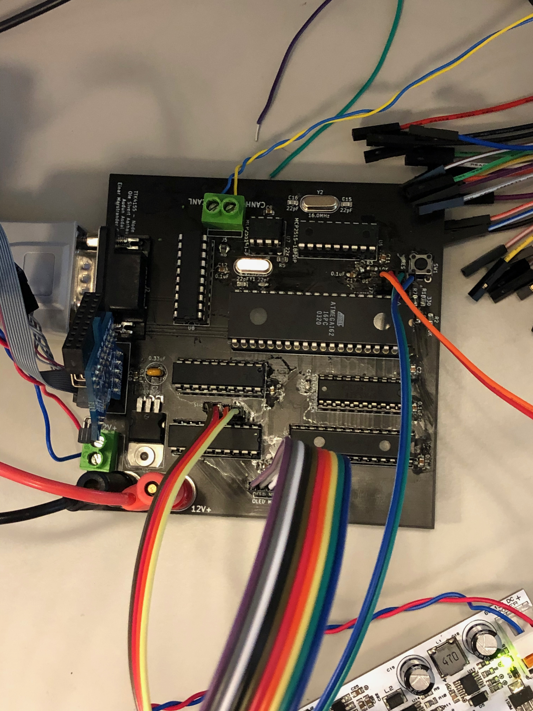

# TTK4155-Embedded-PCB
TTK4155 Embedded and Industrial Computer Systems Design - Circuit board

This is the KiCad source files we used for our schematics during the presentation of the project handin and making a physical more robust board for node 1.

## Before

## After

